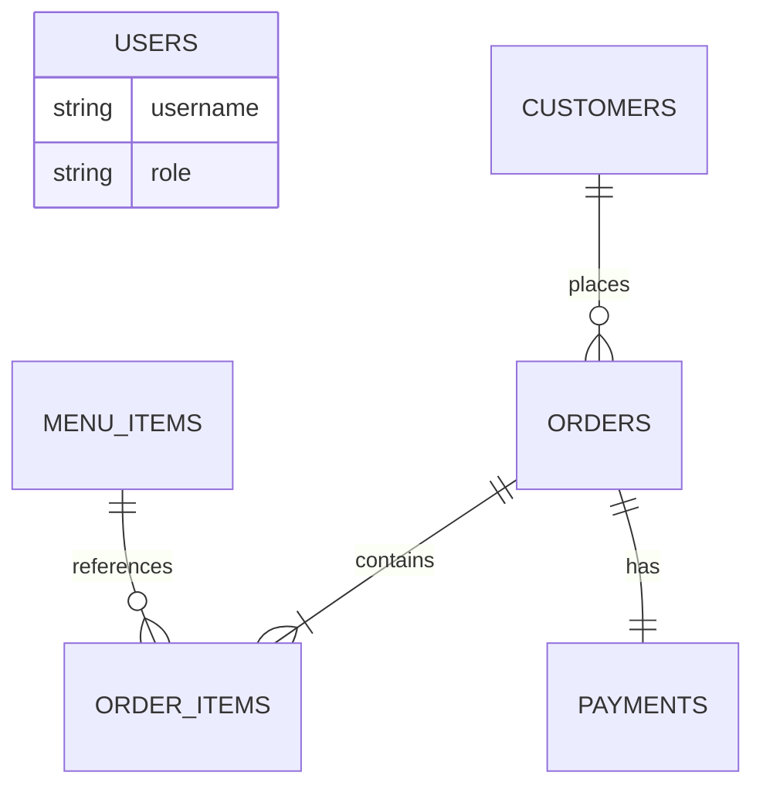

# Restaurant Operations Management System

## Overview

A local-first Streamlit application for a small restaurant. Customers can browse an image-backed menu, place orders, and track an order. Authenticated staff operate orders and payments; admins additionally manage menu/customer data and exports. SQLite runs without any cloud account.

## Features

- Separate customer, staff, and admin experiences
- PBKDF2-hashed database users and centralized role authorization
- Customer validation, menu availability, itemized orders, payments, and controlled statuses
- Decimal billing with staff-only discounts
- Dashboard metrics, CSV exports, backup/restore, health checks, and structured logging
- Portable product imagery with safe category fallbacks

## Architecture

```text
Streamlit UI -> authorization/service layer -> SQLAlchemy -> SQLite
```

This modular monolith is intentionally appropriate for one small business.

## Database



Money uses `Numeric`/`Decimal`; SQLite foreign keys are enabled on every connection.

## Local Setup

```bash
git clone <repository-url>
cd dagar_hotel
python3 -m venv .venv
source .venv/bin/activate
pip install -r requirements.txt
cp .env.example .env
python -m scripts.init_db
python -m scripts.seed_demo_data
streamlit run app/main.py
```

Windows activation: `.venv\Scripts\Activate.ps1`.

## Demo Login

For local development/demo only:

| Role | Username | Password |
| --- | --- | --- |
| Admin | `admin` | `admin123` |
| Staff | `staff` | `staff123` |

These fictional accounts are created by the demo seed only when `APP_ENV=development`.
Passwords are PBKDF2-hashed before database storage. Seeding is idempotent and does not
overwrite an existing password. Production mode does not bootstrap or trust these accounts.

## Roles

Admin can access the complete dashboard, customer management/exports, menu management,
orders, payments, and reports. Staff can look up/create customers, view menu availability,
create orders, update permitted statuses, and record payments. Central route authorization
enforces these permissions in addition to showing role-appropriate navigation.

## Configuration

```dotenv
DATABASE_URL=
APP_ENV=development
LOG_LEVEL=INFO
TAX_RATE=5
MINIMUM_ORDER_AMOUNT=200
```

Empty `DATABASE_URL` uses ignored `data/restaurant.db`. For production-style use, set
`APP_ENV=production` and explicitly provision private database users; never run the demo seed.

## Menu/Product Images

The original application assets are reused only for genuine matches: cold drink, dahi, dal,
sada roti, shahi paneer, and matar mushroom in the current seeded menu. Existing tea,
paratha, and tandoori-roti images are mapped for matching future items. Logo and UPI assets
remain non-product assets.

Three optimized original generic fallbacks cover curries, breads, and sides/drinks where a
specific image is unavailable. They are generic UI assets?not photographs of actual restaurant
food. The centralized resolver stores repository-relative paths, validates files, and returns a
fallback instead of crashing.

## Local Persistence, Backup, and Export

The database lives at `data/restaurant.db`; restarts preserve all records.

```bash
python -m scripts.backup_db
python -m scripts.restore_db backups/<backup-file>.db --confirm
```

Generated databases and `backups/` are ignored. Admin CSV downloads cover customers,
orders/sales, and payments without exposing password hashes.

## Testing

Verified result: **35 passed, 0 failed, 54% overall coverage**. Core models, database,
billing, menu, authentication, authorization, assets, exports, and security modules are
81-100% covered.

```bash
pytest --cov=app
ruff check .
python -m scripts.health_check
git diff --check
```

Tests use isolated temporary/in-memory databases, never the local restaurant database.

## Security

- Password hashes, never plaintext passwords, are stored in `users`
- Demo bootstrap is development-only
- Role authorization is separate from authentication
- SQLAlchemy uses bound parameters and transaction rollback
- UI errors hide internal stack traces; logs avoid credentials/PII
- `.env`, SQLite files, backups, logs, caches, and virtual environments are ignored
- A legacy credential existed in Git history and must remain revoked

## Engineering Decisions and Limitations

SQLite gives zero-friction local persistence and backups; SQLAlchemy retains optional
PostgreSQL portability. Streamlit and short local transactions do not benefit from artificial
async. The system targets one business/laptop, uses coarse admin/staff roles, and has no online
payment gateway, card storage, or multi-server synchronization.

## Optional Production Evolution

Use private user provisioning, strong password lifecycle/reset rules, HTTPS, managed secrets,
audit logs, migrations, and PostgreSQL for a public multi-user deployment. Public demo
credentials must never be provisioned there.

## Screenshots

Add real captures under `docs/screenshots/`:

1. Login screen
2. Admin dashboard
3. Staff dashboard
4. Menu/Create Order with product images
5. Customer management
6. Orders & Payments
7. Admin menu management

No fabricated application screenshots are included.
