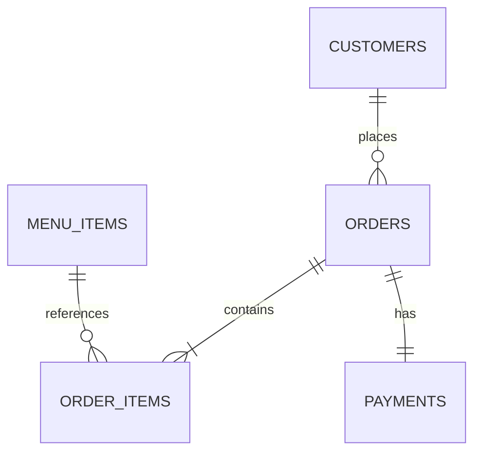

# Restaurant Operations Management System

## Overview

A local-first Streamlit application for day-to-day restaurant operations at a small hotel. Staff can maintain customers and menu availability, create itemized orders, record payments, move orders through a controlled preparation workflow, and export operational records. SQLite provides durable zero-configuration storage on one laptop; SQLAlchemy keeps optional PostgreSQL compatibility.

## Business Problem

The original application mixed interface code, SQL, credentials, menu prices, and order logic in one file. It stored entire orders as text, which made reporting and reliable updates difficult. This refactor provides structured local records, consistent billing, recoverable backups, and clear operational workflows without unnecessary infrastructure.

## Features

- Customer create, search, and update-by-mobile with phone/email validation
- Separate public customer-ordering and password-protected staff portals
- Staff-only discounts, payment confirmation, operational records, and menu controls
- Categorized menu management with availability controls
- Transactional order, line-item, and payment creation
- Decimal subtotal, discount, configurable tax, and total calculations
- Enforced `pending ? preparing ? ready ? completed` workflow and safe cancellation rules
- Payment validation with Cash, UPI, or Card labels; no card details are stored
- Daily orders, paid revenue, average order value, active/completed orders, and popular items
- Customer, order/sales, and payment CSV downloads
- Timestamped SQLite backup and confirmation-protected restore
- Local health check, fictional demo seed, tests, linting, logging, and admin password gate

Room booking is intentionally excluded because it was not part of the original restaurant workflow.

## Architecture

```text
Streamlit UI
      ?
Service Layer
      ?
SQLAlchemy
      ?
SQLite (default local database)
```

PostgreSQL remains an optional configuration, not a runtime requirement.

## Why This Architecture?

A modular monolith fits one small restaurant and one deployment. Streamlit keeps the staff interface simple, services enforce rules independently of widgets, and SQLAlchemy transactions prevent partial orders. Separate microservices, queues, and Redis would add operational cost without solving a current problem.

## Database Schema



- `customers`: contact details and timestamps
- `menu_items`: category, price, and availability
- `orders`: status and immutable bill totals
- `order_items`: quantity and price snapshot
- `payments`: amount, method, status, reference, and payment time

Foreign keys are enabled explicitly for SQLite. Money uses `Numeric`/`Decimal`, not floating point.

## Business Workflow

```text
Customer ? Order + Items ? Preparation ? Ready ? Payment ? Completion
```

Order creation writes the order, items, and payment record in one transaction. An exception rolls back the complete graph.

## Tech Stack

Python 3.11+, Streamlit, SQLAlchemy, SQLite, pandas, pytest, pytest-cov, and Ruff. Psycopg is retained only for optional PostgreSQL use.

## Project Structure

```text
app/                 UI, services, models, configuration
assets/              Preserved restaurant images
data/.gitkeep        Local DB location; generated DB files ignored
docs/                Interview notes and screenshot placeholders
scripts/             Init, seed, health, backup, restore, password tools
tests/               Isolated business and persistence tests
```

## Local Setup

```bash
git clone <repository-url>
cd dagar_hotel
python3 -m venv .venv
source .venv/bin/activate
pip install -r requirements-dev.txt
cp .env.example .env
python -m scripts.init_db
python -m scripts.seed_demo_data
streamlit run app/main.py
```

Windows activation: `.venv\Scripts\Activate.ps1`.

## Configuration

```dotenv
DATABASE_URL=
APP_ENV=development
LOG_LEVEL=INFO
TAX_RATE=5
MINIMUM_ORDER_AMOUNT=200
APP_ADMIN_PASSWORD_HASH=
```

An empty `DATABASE_URL` automatically uses `data/restaurant.db`. Customer ordering works without login; staff administration always requires a configured hash. Generate it with `python -m scripts.hash_password`, place it in local `.env`, and restart Streamlit.

## Local Persistence and Demo Data

The database is `data/restaurant.db`. Streamlit restarts do not remove customers, menu changes, orders, payments, or statuses. The idempotent seed command can be run repeatedly:

```bash
python -m scripts.seed_demo_data
```

It uses only clearly fictional data.

## Backup and Restore

```bash
python -m scripts.backup_db
python -m scripts.restore_db backups/restaurant_YYYY-MM-DD_HHMMSS_microseconds.db --confirm
```

Backups are timestamped and placed in ignored `backups/`. Restore refuses to overwrite the active database unless `--confirm` is supplied. Stop Streamlit before restoring.

## Exporting Data

Use download buttons on Customers and Orders & Payments pages. Exports include customers, orders/sales, and payments. They contain no credentials or password hashes.

## Tests and Health Check

Verified result: **31 passed, 0 failed, 54% overall coverage**. Core business, persistence, security, and export modules are 81-100% covered; Streamlit portals were additionally verified with Streamlit AppTest.

```bash
pytest --cov=app
ruff check .
python -m scripts.health_check
git diff --check
```

Tests use isolated in-memory or temporary SQLite databases and never modify `data/restaurant.db`.

## Security

Secrets are environment-based and ignored. Production-style mode requires a salted PBKDF2-SHA256 password hash. SQLAlchemy produces parameterized statements, service validation protects business rules, errors shown to operators hide stack traces, transaction failures roll back, and logs avoid customer details and credentials. The legacy database password was removed from the current tree; it must remain revoked because it existed in Git history.

## Engineering Decisions

- SQLite: zero-cost local operation and simple backups
- SQLAlchemy: explicit schema, transactions, and optional PostgreSQL portability
- Service layer: rules remain testable outside Streamlit
- Decimal money: deterministic currency arithmetic
- Synchronous execution: Streamlit and short local DB transactions gain nothing from async
- Async would become appropriate for concurrent external APIs, long network I/O, or a high-concurrency web API

## Limitations

Designed for one small business and primarily one laptop. Authentication uses one shared staff credential rather than individual staff accounts or permissions. There is no online payment gateway, card storage, invoice PDF, or automated multi-device synchronization. SQLite is not appropriate for multiple application servers.

## Optional Future Deployment

For cloud deployment, configure a managed PostgreSQL `DATABASE_URL`, external secrets, backups, HTTPS, and provider-specific startup settings. Cloud hosting is optional and is not part of the verified local workflow.

## Screenshots

Add real captures under `docs/screenshots/` for:

1. Dashboard
2. Create Order
3. Orders & Payments
4. Menu Management
5. Customers

No generated or fabricated screenshots are included.
